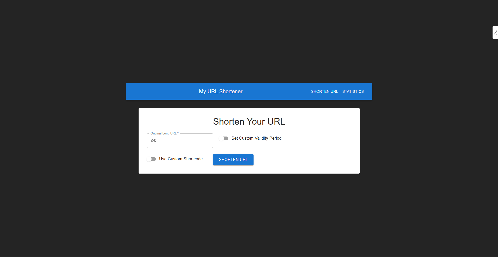
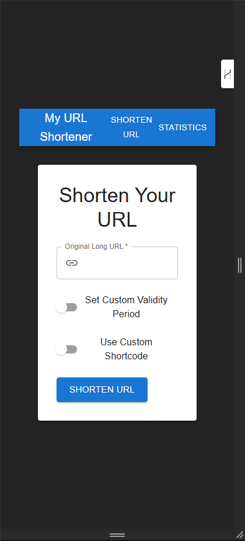

# My URL Shortener

**Author:** J S M Eshwar Katakam  
**Registration Number:** 12203539

---

## Application Screenshots

### Laptop View


### Mobile View


---

## Quick Troubleshooting: Import Error in React

If you see an error like `Failed to resolve import...`, it's usually a file path issue, not a code bug.

**The Problem:**
Your `App.jsx` file is looking for `ShortenerPage.jsx` and `StatisticsPage.jsx` in the wrong place. It's trying to find them at `/pages/` (absolute path).

**The Fix:**
Just use a relative path:

- In `src/App.jsx`, change:
  ```js
  import ShortenerPage from '/pages/ShortenerPage';
  import StatisticsPage from '/pages/StatisticsPage';
  ```
  to:
  ```js
  import ShortenerPage from './pages/ShortenerPage';
  import StatisticsPage from './pages/StatisticsPage';
  ```
- Save the file and restart your dev server (`npm run dev`).

This is like fixing a file path in a data pipeline so your functions can find the right modules. Once done, your app should load properly.

---

# React + Vite

This template provides a minimal setup to get React working in Vite with HMR and some ESLint rules.

Currently, two official plugins are available:

- [@vitejs/plugin-react](https://github.com/vitejs/vite-plugin-react/blob/main/packages/plugin-react) uses [Babel](https://babeljs.io/) for Fast Refresh
- [@vitejs/plugin-react-swc](https://github.com/vitejs/vite-plugin-react/blob/main/packages/plugin-react-swc) uses [SWC](https://swc.rs/) for Fast Refresh

## Expanding the ESLint configuration

If you are developing a production application, we recommend using TypeScript with type-aware lint rules enabled. Check out the [TS template](https://github.com/vitejs/vite/tree/main/packages/create-vite/template-react-ts) for information on how to integrate TypeScript and [`typescript-eslint`](https://typescript-eslint.io) in your project.


